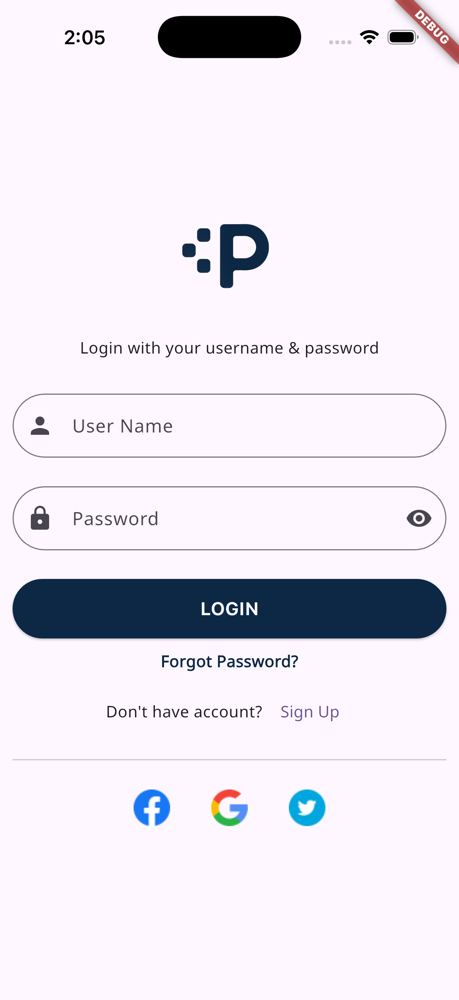
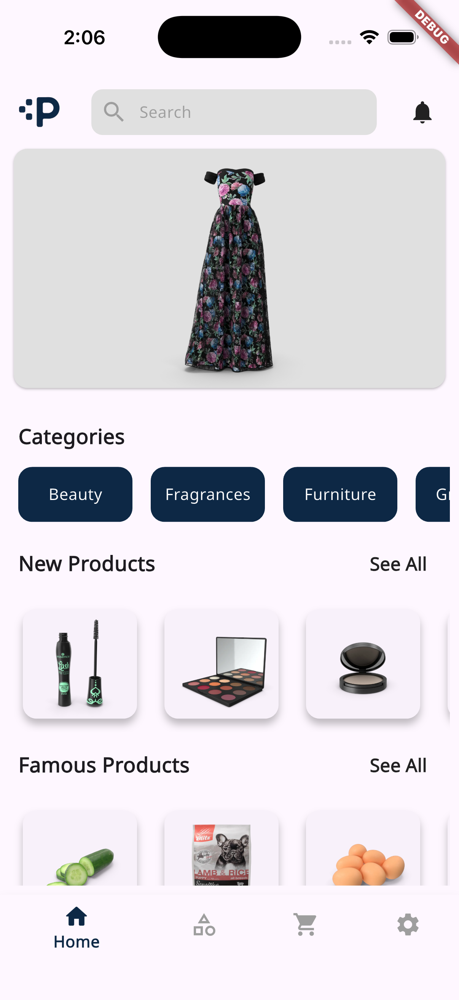
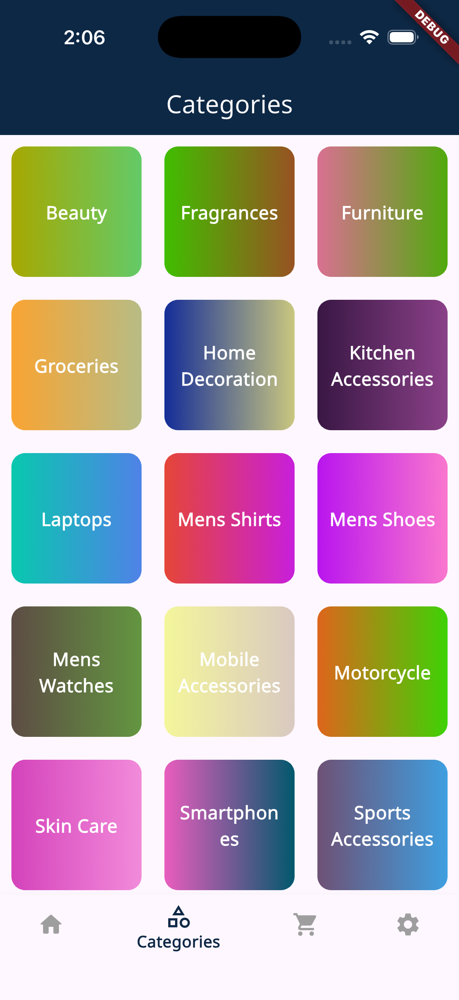
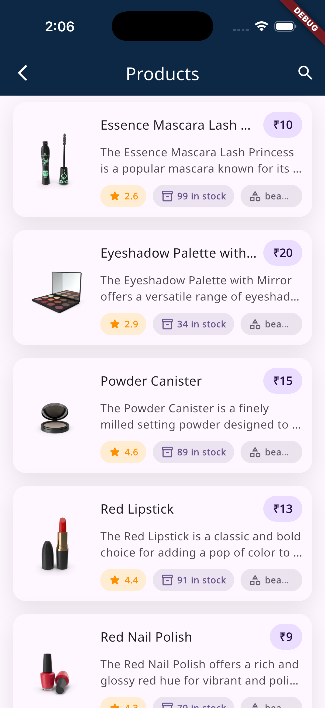
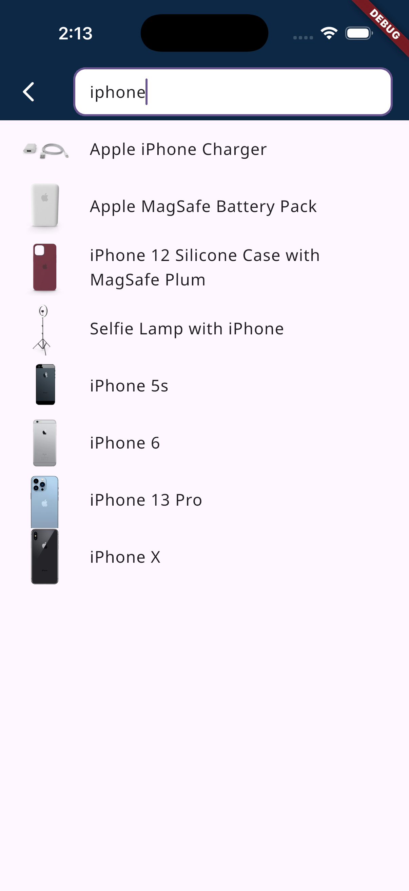
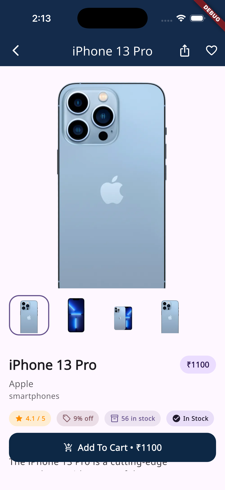
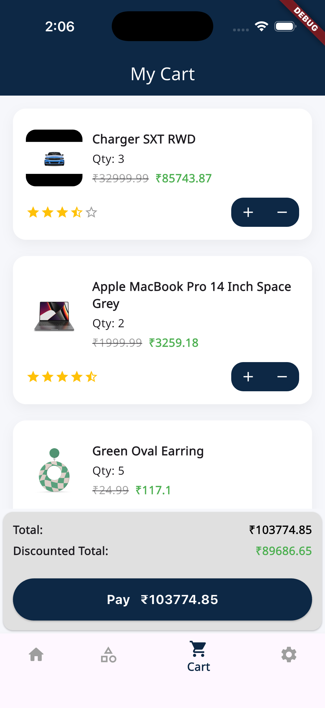

# Plux

Plux is a modern E-commerce mobile application built with Flutter. It follows Clean Architecture principles and uses Riverpod for state management.

## 📱 Features

- **Authentication**: Secure login functionality.
- **Product Browsing**: Browse products by category or search.
- **Product Details**: View detailed information about products.
- **Cart Management**: Add items to cart and manage them.
- **Modern UI**: Clean and responsive user interface with skeleton loading states.

## 🛠 Tech Stack

- **Framework**: [Flutter](https://flutter.dev/)
- **Language**: Dart
- **State Management**: [Riverpod](https://riverpod.dev/)
- **Navigation**: [GoRouter](https://pub.dev/packages/go_router)
- **Networking**: [Dio](https://pub.dev/packages/dio)
- **Code Generation**: [Freezed](https://pub.dev/packages/freezed), [JSON Serializable](https://pub.dev/packages/json_serializable)
- **Storage**: [Flutter Secure Storage](https://pub.dev/packages/flutter_secure_storage)
- **UI Utilities**: [Skeletonizer](https://pub.dev/packages/skeletonizer), [Google Fonts](https://pub.dev/packages/google_fonts)

## 📸 Screenshots

|                        Login                         |                        Home                         |                       Categories                        |
|:----------------------------------------------------:|:---------------------------------------------------:|:-------------------------------------------------------:|
|  |  |  |

|                        Products                         |                          Search                           |                      Product Details                      |
|:-------------------------------------------------------:|:---------------------------------------------------------:|:---------------------------------------------------------:|
|  |  |  |

|                        Cart                         | | |
|:---------------------------------------------------:|:-:|:-:|
|  | | |

## 🏗 Architecture

The project is structured using Clean Architecture to ensure separation of concerns and maintainability.

### 📂 Directory Structure

#### 1. **Config** (`lib/src/config`)
Contains application-wide configuration settings.
- **routes**: Navigation setup using `GoRouter`.
- **services**: Service configurations.
- **generated**: Auto-generated assets and code.

#### 2. **Core** (`lib/src/core`)
The foundational layer containing shared code used across the application.
- **network**: Network clients (e.g., Dio setup), interceptors, and API configurations.
- **storage**: Local storage implementations (e.g., `FlutterSecureStorage`).
- **errors**: Custom exception classes and failure handlers.
- **utils**: Helper functions and utility classes.
- **extensions**: Dart extensions for enhanced functionality.
- **constants**: Application constants (Strings, URLs, styles).

#### 3. **Data** (`lib/src/data`)
Responsible for data retrieval and manipulation from various sources.
- **models**: Data Transfer Objects (DTOs) representing the API response structure, often using `Freezed` or `JsonSerializable`.
- **data_sources**:
    - **Remote**: API calls implementation.
    - **Local**: Database or cache access implementation.
- **repositories_impl**: Concrete implementations of the repositories defined in the Domain layer.

#### 4. **Domain** (`lib/src/domain`)
The core business logic layer, independent of external frameworks.
- **entities**: Pure Dart objects representing business data, used within the app.
- **repositories**: Abstract interfaces defining the contract for data operations.
- **use_cases**: Encapsulates specific business rules and application logic.

#### 5. **Presentation** (`lib/src/presentation`)
The UI layer responsible for rendering views and handling user interactions.
- **views**: Screen layouts and pages.
- **providers**: State management logic using `Riverpod`.
- **common_widgets**: Reusable UI components used throughout the app.

## 🚀 Getting Started

This project is a starting point for a Flutter application.

### Prerequisites
- Flutter SDK
- Dart SDK

### Installation

1. **Clone the repository**
   ```bash
   git clone <repository-url>
   cd plux
   ```

2. **Install dependencies**
   ```bash
   flutter pub get
   ```

3. **Generate code** (if needed for Freezed/Riverpod)
   ```bash
   dart run build_runner build --delete-conflicting-outputs
   ```

4. **Run the app**
   ```bash
   flutter run
   ```

For help getting started with Flutter development, view the
[online documentation](https://docs.flutter.dev/), which offers tutorials,
samples, guidance on mobile development, and a full API reference.
